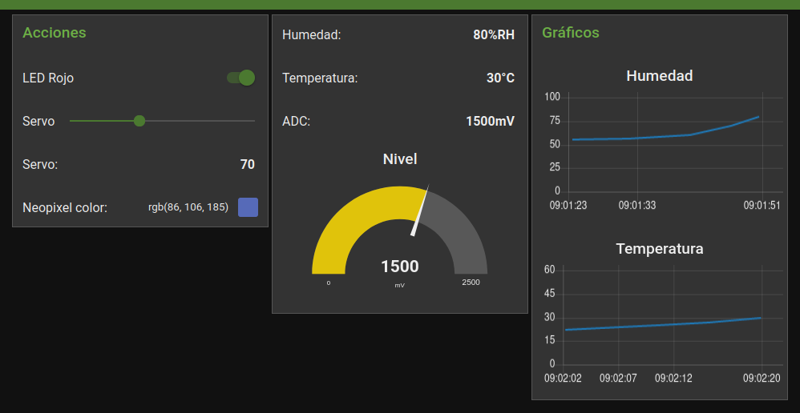

# Hands on IoT

*Hands on Iot* es un curso dictado por el [Laboratorio de Instrumentación Virtual y Robótica Aplicada (LIVRA)](https://livra.fi.mdp.edu.ar/) de la [Facultad de Ingenieria](https://www.fi.mdp.edu.ar/) de la [Universidad Nacional de Mar del Plata](https://www.mdp.edu.ar/).

Los objetivos son:

- Experimentar en las tecnologías que involucra IoT
- Comprender el funcionamiento de los dispositivos IoT basados en microcontrolador
- Conexión y aplicación de Sensores digitales, analógicos y Actuadores
- Desarrollar firmware de los dispositivo IoT y software de Servidores Web
- Conocer y Aplicar herramientas de desarrollo y tecnologías de Plataformas IoT en la nube y API de acceso a los datos
- Reflexionar sobre los usos posibles de esta tecnología

Los contenidos son:

1. **Fundamentos de IoT (Internet of Things).** Concepto de IoT. Ecosistema, Tecnologías, Arquitecturas, Retos, Valor de los datos.

2. **Hardware IoT.** Introducción a microcontroladores para IoT, Análisis de especificaciones, plataformas de desarrollo, ventajas y desventajas de cada una. Selección. Criterios de diseño generales. Diseño de placas de desarrollo.

3. **Software IoT.** Evaluación de entornos de desarrollo y lenguajes de programación disponibles. Selección del entorno de desarrollo y lenguaje de programación. Introducción al lenguaje seleccionado y sus características. Programación y configuración de periféricos.

4. **Sensores, actuadores y periféricos.** Características de sensores, actuadores y periféricos. Selección de módulos según requerimientos. Protocolos de comunicación para conectar módulos externos.

5. **Enlace del gateway hacia la nube.** Análisis de tecnologías disponibles, Comunicación con Gateway, Procesamiento en Gateway. Ejemplos y aplicaciones.

6. **Topologías de red.** Análisis de distintas topologías. Medios de comunicación cableados e inalámbricos. Ejemplos y aplicaciones.

7. **Servicios en la nube.** Instalación y configuración de servicios. Lenguajes de programación gráfica. Diseño de dashboards.

8. **Coordinación de tecnologías.** Enlace entre diversas tecnologías y topologías. Registro, análisis y visualización de datos. Análisis de la estructura desde el dispositivo hasta la nube. Ejemplos de aplicaciones típicas.

## Recursos

- [Curso Hands on IoT](https://livra.fi.mdp.edu.ar/cursos/hands_on_iot/)
- [Clases Hands on IoT, Ciclo 2023](https://youtube.com/playlist?list=PLa6g4FD2PHEynB2oIQH629-fuNWOR_bHg&si=976-oCqbLv87YuOn)

## Trabajo Final

Escribir un programa de flujo de Node-RED que permita interactuar con un programa en MicroPython desarrollado sobre la placa de desarrollo que se comunique a través del protocolo MQTT.

Debe incluir mínimamente:

- Una llave en el dashboard que permita permutar entre encendido y apagado de un LED.

- Un control de colores RGB en el dashboard que permita cambiar de color a uno o varios LED NeoPixel.

- Un control deslizante en el dashboard que permita posicionar un servomotor en la placa de desarrollo para moverlo entre 10 y 170 grados.

- Generar una notificación en el dashboard al dispararse una alarma implementada en la placa de desarrollo.

- Informar en el dashboard el valor medido utilizando el conversor analógico-digital de la placa de desarrollo. Se sugiere que la medición sea de forma continua (periódica a intervalos de 1 segundo) y graficar valores históricos.

- Informar en el dashboard el valor sensado en la placa de desarrollo de temperatura y humedad de forma continua. Se sugieren graficar los valores históricos.

El archivo `./src/pubsub_final.py` es el programa MicroPython desarrollado y el archivo `./src/flows_dashboard_neon.json` el json del programa de Node-RED.

*Captura de pantalla de la Node-RED UI diseñada*