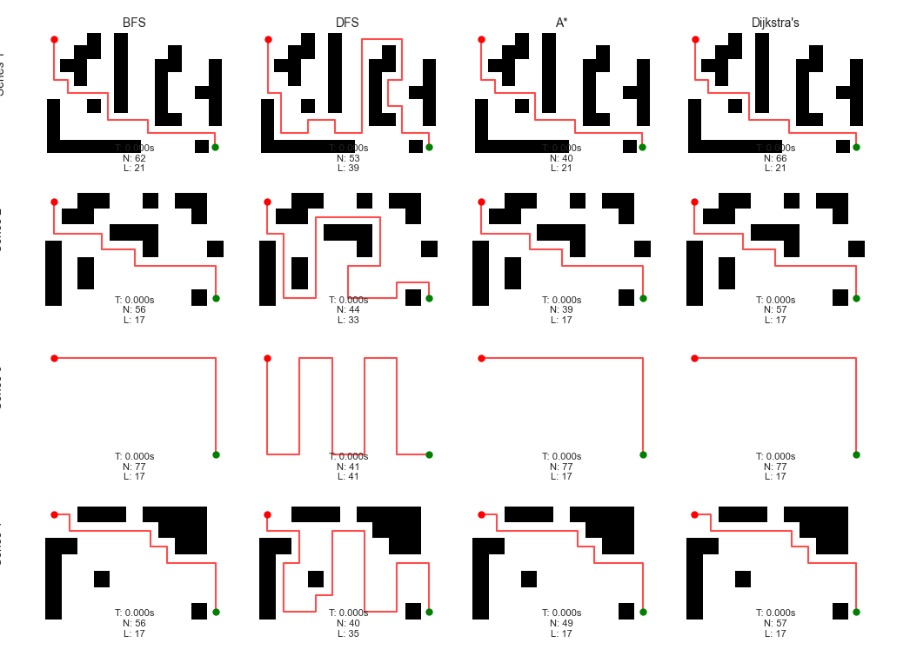

# Maze Solving Algorithms Comparison  

This project showcases a comparison of different pathfinding algorithms for solving mazes. The goal is to evaluate the performance and efficiency of algorithms such as BFS, DFS, A*, and Dijkstra's, ultimately demonstrating why the A* algorithm performs better in most cases.  

  

## 📋 **Project Overview**  
The implementation involves solving mazes of varying complexity using:  
1. **BFS (Breadth-First Search)**  
2. **DFS (Depth-First Search)**  
3. **A* Algorithm**  
4. **Dijkstra's Algorithm**  

Each algorithm is benchmarked based on:  
- **Execution Time**  
- **Number of Nodes Explored**  
- **Path Length**  

The comparison results are visually represented, highlighting the strengths of the A* algorithm.  

---

## 🧩 **Features**  
- **Maze Generation:** Four maze series with different layouts and complexities.  
- **Path Visualization:** The solution paths are plotted on the mazes using Matplotlib.  
- **Performance Metrics:** Each algorithm's execution time, nodes explored, and path length are displayed for comparison.  

---

## 🚀 **Technologies Used**  
- **Python:** Primary programming language.  
- **NumPy:** For efficient matrix operations on mazes.  
- **Matplotlib:** For visualizing the mazes and solution paths.  
- **Heapq & Collections:** For priority queue implementation and BFS/DFS structures.  

---

## 📊 **Algorithm Analysis**  
### **1. Breadth-First Search (BFS):**  
- Explores all possible paths level by level.  
- Guarantees the shortest path but can be slow and memory-intensive.  

### **2. Depth-First Search (DFS):**  
- Explores paths deeply before backtracking.  
- Not guaranteed to find the shortest path and may explore unnecessary nodes.  

### **3. A-star Algorithm:**  
- Combines the strengths of Dijkstra's algorithm and a heuristic (Manhattan distance).  
- Optimally balances exploration and pathfinding efficiency.  
- **Best Performance:** Finds the shortest path with the least computational effort.  

### **4. Dijkstra's Algorithm:**  
- Similar to A*, but without a heuristic.  
- Explores all possible nodes, leading to inefficiency in larger mazes.  

---

## 📈 **Why A-star Is the Best Algorithm**  
- **Efficiency:** Explores fewer nodes due to its heuristic-driven approach.  
- **Accuracy:** Always finds the shortest path.  
- **Scalability:** Performs well even on larger and more complex mazes.  

---

## 📂 **Project Structure**  
```         
├── exp_1.py                   # main file
├── README.md                  # Project documentation
└── results/                   # Figures & results 
```  

---

## 📸 **Visualization**  
The project includes a detailed comparison figure displaying:  
1. Solution paths for each algorithm.  
2. Performance metrics (Time, Nodes Explored, Path Length).  

---

## 🧑‍💻 **How to Run**  
1. Clone the repository:  
   ```bash
   git clone https://github.com/agneya-1402/maze-solving-algorithms-comparison.git
   cd maze-solving-algorithms-comparison
   ```  
2. Install dependencies:  
   ```bash
   pip install numpy matplotlib  
   ```  
3. Run the main script:  
   ```bash
   python exp_1.py  
   ```  

---

## 🤝 **Contributing**  
Feel free to open issues or submit pull requests for improvements and new features.  

---

## 📜 **License**  
This project is licensed under the MIT License.  
